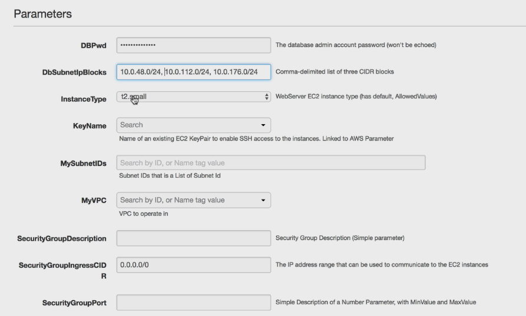

# CloudFormation Parameters
## Parameters Overview
parameters
: a way to provide inputs to your AWS CloudFormation Template
### When to use
- reuse your templates across the company
- for input that can not be determined ahead of time
## Parameters Theory and Hands-On
### Controlled by these settings
- Type
   - String
   - Number
   - CommaDelimitedList
   - List<Type>
   - AWS Parameters
   - AWS Paramter
- Description
- Constraints
- ConstraintDescription
- Min/MaxLength
- Min/MaxValue
- Defaults
- AllowedValues(array)
- AllowedPattern(regex)
- NoEcho(boolean)
### Example
```yaml
Parameters:
  SecurityGroupDesription:
    Description: Security Group Description (Simple Parameter)
    Type: String
  SecurityGroupPort:
    Description: Simple Description of a Number Parameter
    Type: Number
    MinValue: 1150
    MaxValue: 65535
  InstanceType:
    Description: WebServer EC2 instance type
    Type: String
    Default: t2.small
    AllowedValues:
      - t1.micro
      - t2.nano
    ConstraintDescription: must be a valid EC2 instance type
  DBPwd:
    NoEcho: true
    Description: db password
    Type: String
  KeyName:
    Description: name of EC2 key pair
    Type: AWS::EC2::KeyPair::KeyName
    ConstraintDescription: must be the name of an existing EC2 KeyPair
  SecurityGroupIngressCIDR:
    Descriptioni: IP address range
    Type: String
    MinLength: '9'
    MaxLength: '18'
    Default: 0.0.0.0/0
    AllowedPattern: (\d{1,3})\.(\d{1,3})\.(\d{1,3})\.(\d{1,3})/(\d{1,2})
    ConstraintDescription: must be valid CIDR
  MyVPC: 
    Description: VPC to operate in 
    Type: AWS::EC2::VPC::Id
  MySubnetIDs:
    Description: subnet IDs that is a list of Subnet Id
    Type: "List<AWS::EC2::Subnet::Id>"
  DbSubnetIpBlocks:
    Description: "csv of 3 CIDR"
    Type: CommaDelimitedList
    Default: "10.0.48.0-\/24, 10.0.112.0/24, 10.0.176.0/24"
Resources:
  MyEC2Instance:
    Type: "AWS::EC2::Instance"
    Properties: 
      InstanceType: !Ref InstanceType
      KeyName: !Ref KeyName
      ImageId: "ami-dafasdf"
      SubnetId: !Ref DbSubnet1
```
### Applying parameters in AWS Console

## How to Reference a Parameter
- Fn::Ref or !Ref


