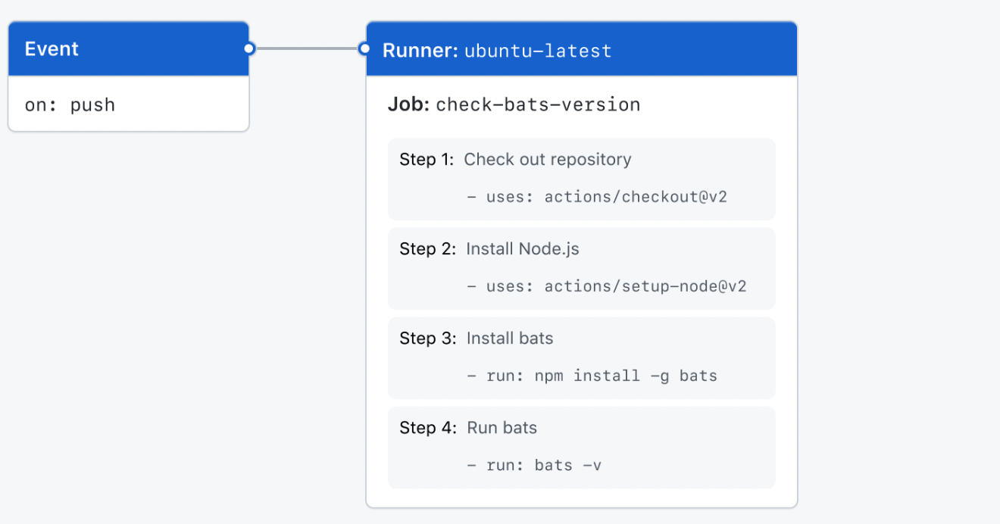

# Components of GitHub Actions
## Workflows
- defined in .github/workflows by a YAML
- triggerd by an event, manually, or schedule
- can use another workflow
## Event
- a specific activity in a repository
- manually
- schedule
## Jobs
- a set of steps
- step
  - uses action ( see below)
  - run command
## Actions
- action is a custom application for the GitHub Actions platform
- reduce the amount of repetitive code
## Runners
- a server that runs your workflows
- runs a single job at a time
- GitHub provides Ubuntu Linux, MS Windows, MacOS runners
- you can host your own runners
# Example

```yaml

```


  
  
  
